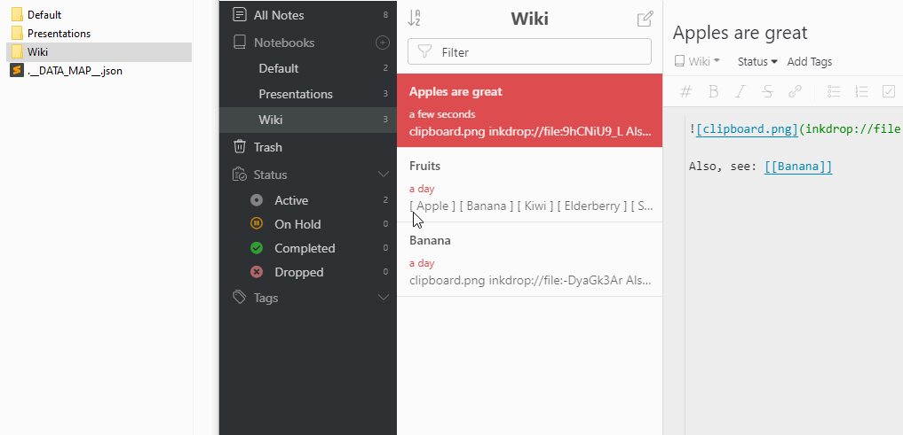
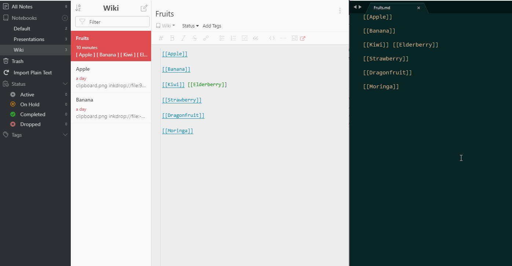

# Inkdrop plain text backups

Plain text backups and import for Inkdrop.

For this plugin to function, you must have the Backup Path set in the Inkdrop desktop app.

Then, backups will be created under:

```
{{ BACKUP_PATH }}/PLAIN_TEXT/{{ NOTEBOOK_NAME }}/{{ NOTE_TITLE }}.md
```

A full backup is done on the initial app launch or activation, after that, changes are written using the database `onChange` event.

Now with renaming support!



And import support!



## Known limitations:

-   **Inkdrop must be running before modification** of files in the _PLAIN_TEXT_ directory, because all notes are backed up on app launch.
-   Renaming of files or folders inside of the _PLAIN_TEXT_ directory is not supported at this time, please rename inside of Inkdrop.
-   File creation inside of the _PLAIN_TEXT_ directory is not supported at this time, please create files inside of Inkdrop.
